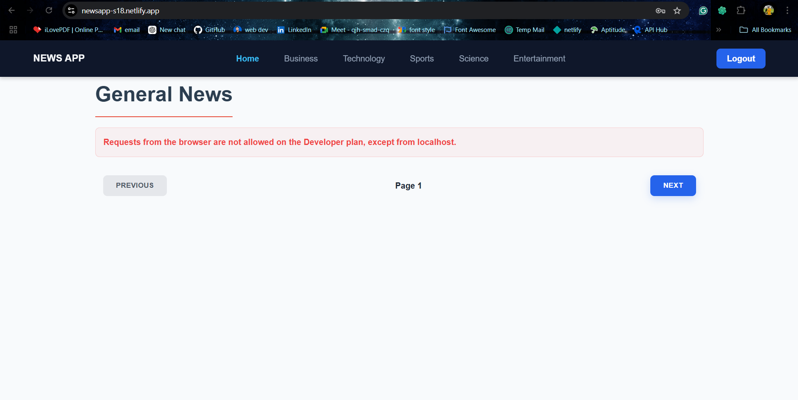

# NewsApp

## Setup Instructions

1. **Clone the repository**  
   Clone the repository to your local machine using the following command:
   ```sh
   git clone https://github.com/hrithik-anotech/Assignment.git


2. Install the required packages.
    ```sh
    cd Assignment
    npm install
    ```

3. Start the development server.
    ```sh
    npm run dev
    ```

1. Open the project in your browser at [`http://localhost:PORT`](http://localhost:PORT) to view your project.

2. the project is hosted on [`https://newsapp-s18.netlify.app/`](https://newsapp-s18.netlify.app/)

Issue While Hosting
When trying to host the website, an error occurred with the API. 
Below is a screenshot of the problem encountered:



Video Demonstration
demonstrates the project working correctly on localhost
Watch the project demonstration on [YouTube](https://youtu.be/xAX5-nj53uQ?si=Ffsgp2UbKhoVwiqw).
